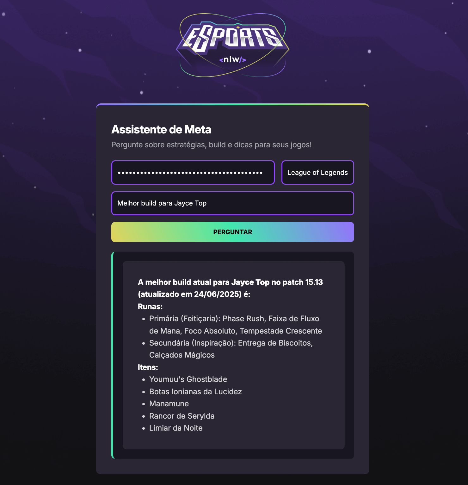

# 🎮 AI Gaming Assistant

This is a web application developed during **NLW 20 – Beginner Full-Stack Track**, promoted by [Rocketseat](https://rocketseat.com.br/).  
The project is an intelligent assistant for gamers, capable of answering questions about builds, strategies, and gameplay tips by integrating with the **Google Gemini API**.

---

## 🚀 Technologies

- HTML5
- CSS3 (with animations and gradients)
- JavaScript (ES6+)
- Google Gemini API

---

## 🧠 Key Learnings

- How to integrate generative AI (LLM) into front-end projects
- Asynchronous JavaScript: `fetch`, `async/await`, `try/catch`
- DOM manipulation and prompt engineering fundamentals

---

## 🔗 Live Preview

You can access the project here:  
👉 [https://thaisdmm.github.io/nlw-20-agents-beginner/](https://thaisdmm.github.io/nlw-20-agents-beginner/)

---

## 📸 Screenshot

---

**Built with curiosity, creativity, and a focus on real applications of AI in the browser.**
